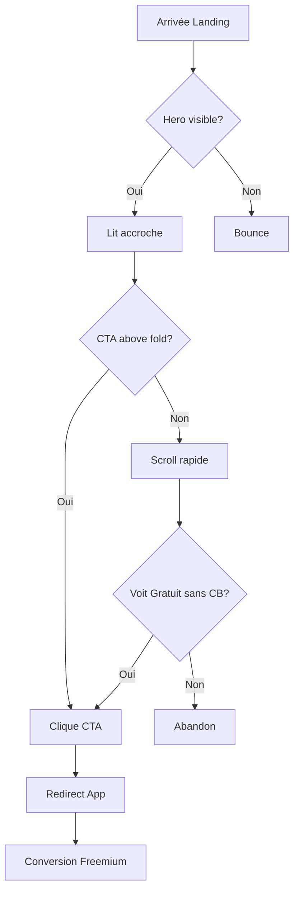
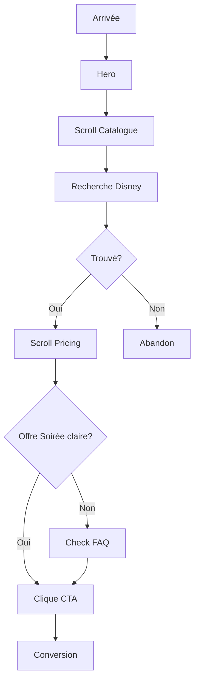
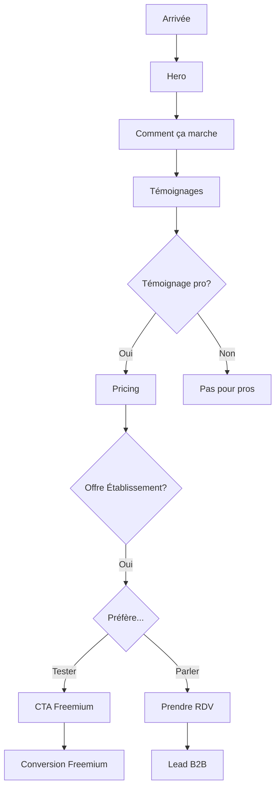
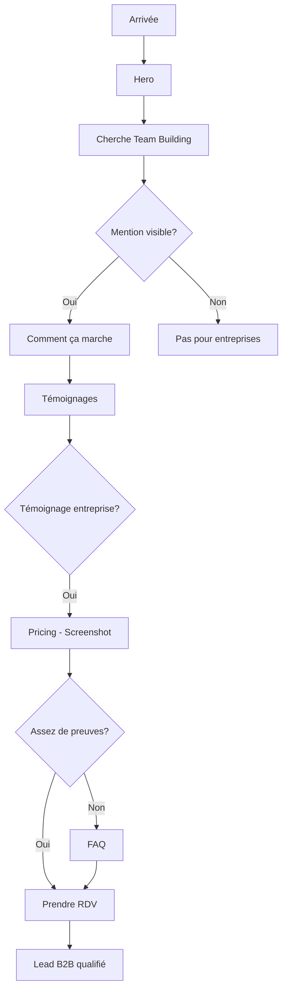

# UX Design Specification karaoke-landing-page

**Author:** Guillaume
**Date:** 2026-01-18

---

## Executive Summary

### Project Vision

Landing page de conversion multi-langue (FR/EN/ES) pour un SaaS karaoké, orchestrant le passage d'une vente commerciale B2B manuelle vers une acquisition digitale self-serve couvrant à la fois le B2B (70%) et le B2C (30%).

**Accroche centrale :** "Chantez. Jouez. Vibrez."

**Proposition de valeur :** Plateforme d'animation complète (Karaoké + Blind Test + Quiz), pas seulement un karaoké. Autonomie totale 24/7 avec modèle freemium sans friction.

### Target Users

| Persona | Segment | Objectif | Temps Conversion | Besoin Principal |
|---------|---------|----------|------------------|------------------|
| Marc (Gérant bar) | B2B | Animer sans effort | 3-5 min | Autonomie clients, ROI |
| Sophie (RH) | B2B | Team building accessible | 5-10 min | Preuves pour vente interne |
| Lucas (Particulier) | B2C | Soirée immédiate | < 1 min | Vitesse, gratuit |
| Parent | B2C | Occuper les enfants | 2-3 min | Simplicité, contenu adapté |

**Pattern comportemental clé :** B2C = vitesse et impulsion. B2B = rassurance et preuves.

### Key Design Challenges

1. **Unifier B2B et B2C** — Une seule landing doit convertir deux segments aux attentes opposées (rassurance vs impulsion)
2. **Gérer le delta de temps** — Design permettant une conversion en 45s (Lucas) comme en 10min (Sophie) sans pénaliser l'un ou l'autre
3. **Clarifier sans complexifier** — Communiquer "plus qu'un karaoké" dès le Hero sans créer de confusion cognitive
4. **Multi-langue cohérent** — Maintenir la qualité UX et le ton de marque sur 3 langues avec preuves sociales adaptées

### Design Opportunities

1. **Auto-segmentation par pricing** — Les noms d'offres guident naturellement chaque segment vers son plan sans friction cognitive
2. **Catalogue comme preuve** — La recherche interactive transforme une feature en argument de conversion immédiat
3. **Témoignages identifiables** — Segmenter visuellement (bar/RH/particulier) permet la reconnaissance instantanée
4. **Freemium sans barrière** — "Sans carte bancaire" + accès immédiat = levier de conversion impulsive majeur

---

## Core User Experience

### Defining Experience

**Action Core :** Convertir un visiteur en utilisateur freemium en moins de 30 secondes depuis le premier scroll.

**Parcours type :**
1. Atterrissage → Vidéo Hero + Accroche capte l'attention (< 3 sec)
2. Scroll optionnel → Validation par contenu (catalogue, témoignages, pricing)
3. Clic CTA → Redirection immédiate vers app SPA
4. Expérience freemium → Hook utilisateur sans friction

**Différenciation :** La landing ne vend pas, elle démontre. Le catalogue preview et le modèle "sans carte bancaire" transforment la page en avant-goût de l'expérience réelle.

### Platform Strategy

| Dimension | Choix | Justification |
|-----------|-------|---------------|
| Architecture | MPA statique | SEO optimisé, Core Web Vitals |
| Approche | Mobile-first | 60%+ trafic mobile estimé |
| Touch targets | Min 44px | Accessibilité tactile |
| Responsive | 3 breakpoints | Mobile < 768px, Tablet 768-1024px, Desktop > 1024px |
| Langues | FR/EN/ES | Marchés cibles dès MVP |

**Flux technique :** `Landing (MPA) → Clic CTA → Redirect → App (SPA existante)`

### Effortless Interactions

| Interaction | Objectif "Zero Effort" |
|-------------|------------------------|
| Scroll | Fluide, sections bien délimitées, ancres prévisibles |
| Recherche catalogue | Résultats instantanés, pas de chargement visible |
| Changement langue | Persistance position scroll, transition immédiate |
| CTA principal | Visible sans scroll (above fold), répété en bas |
| Pricing | Compréhensible en 5 secondes (noms auto-segmentants) |

**Anti-patterns à éviter :**
- Popup intrusive
- Formulaire avant conversion
- Animation bloquante
- Chargement visible du catalogue

### Critical Success Moments

| Moment | Indicateur de Succès | Risque si Raté |
|--------|---------------------|----------------|
| **First Impression** (0-3 sec) | Vidéo charge, accroche visible | Bounce immédiat |
| **Catalogue Discovery** | Chanson connue trouvée en 1 recherche | Doute sur richesse catalogue |
| **Pricing Clarity** | Offre identifiée en 5 sec | Paralysie décisionnelle |
| **CTA Click** | Transition fluide vers app | Frustration, abandon |
| **Témoignage Recognition** | Persona se reconnaît dans un témoignage | Manque de confiance |

**Moment "Aha!" par persona :**
- Marc : "Les clients gèrent via QR code pendant que je sers"
- Sophie : "Même les timides participent"
- Lucas : "Première chanson en 2 min"
- Parent : "Reine des Neiges disponible"

### Experience Principles

1. **Speed > Perfection** — Un utilisateur converti en 45 sec vaut mieux qu'un design parfait qui prend 5 min à comprendre
2. **Show, Don't Tell** — Le catalogue preview prouve, les features listent
3. **Segment par le contenu, pas par la structure** — Une seule page, des témoignages et visuels qui parlent à chaque persona
4. **Zero Friction to Value** — Aucune barrière entre le CTA et l'expérience réelle (pas de compte, pas de CB)
5. **Mobile-First, Desktop-Enhanced** — L'expérience mobile est complète, le desktop ajoute de l'espace, pas des features

---

## Desired Emotional Response

### Primary Emotional Goals

**Émotion dominante :** Excitation accessible — L'anticipation du plaisir sans la peur de l'échec.

| Cible | Émotion Primaire | Déclencheur |
|-------|------------------|-------------|
| B2C | Excitation ("j'ai envie d'essayer maintenant") | Vidéo Hero + Ticker chansons |
| B2B | Confiance ("ça va marcher pour mon business") | Témoignages + Pricing clair |
| Tous | Soulagement ("c'est simple") | "Sans carte bancaire" + 3 étapes |

**Émotions à éviter :**
- Intimidation (karaoké = performance)
- Confusion (trop d'options)
- Méfiance (freemium = piège ?)
- Ennui (landing corporate fade)

### Emotional Journey Mapping

| Phase | État Émotionnel | Design Response |
|-------|-----------------|-----------------|
| **Découverte** (0-3 sec) | Curiosité → Intérêt | Vidéo immersive, accroche punchy |
| **Exploration** (3-30 sec) | Intérêt → Validation | Catalogue preview, témoignages |
| **Décision** (30-60 sec) | Validation → Confiance | Pricing clair, "sans CB" |
| **Action** (clic CTA) | Confiance → Excitation | Transition fluide vers app |
| **Post-clic** | Excitation → Satisfaction | Expérience freemium immédiate |

**Pic émotionnel cible :** Au moment du clic CTA, l'utilisateur doit ressentir de l'anticipation positive, pas du doute.

### Micro-Emotions

| Micro-Émotion | Importance | Design Trigger |
|---------------|------------|----------------|
| **Confiance** | Critique | HTTPS, témoignages vérifiables, design pro |
| **Appartenance** | Élevée | Visuels inclusifs (bar, famille, bureau) |
| **Nostalgie** | Moyenne | Ticker avec chansons connues, décennies |
| **Fierté anticipée** | Élevée | "Animez des soirées inoubliables" |
| **Sécurité** | Critique pour B2B | "Sans engagement", FAQ rassurante |

**Anti-émotions à designer contre :**
- Timidité → "On chante ENSEMBLE" + modes non-chantant visibles
- FOMO négatif → Pas de compteur de places limitées artificiel
- Pression → Pas de popup urgente

### Design Implications

| Émotion Cible | Implication UX |
|---------------|----------------|
| Excitation | Vidéo dynamique, couleurs vives mais pas agressives |
| Confiance | Espace blanc, hiérarchie claire, pas de dark patterns |
| Soulagement | Étapes numérotées, langage simple, CTA direct |
| Appartenance | Photos réelles (pas stock), diversité de contextes |
| Anticipation | Aperçu du catalogue comme "teaser" de l'expérience |

### Emotional Design Principles

1. **Fun ≠ Frivole** — Le ton est joyeux mais le design reste professionnel (crédibilité B2B)
2. **Rassurer sans ralentir** — Les éléments de réassurance (FAQ, témoignages) ne doivent pas bloquer le parcours impulsif
3. **Inclusif par défaut** — Visuels et copie montrent que TOUT LE MONDE peut participer (pas de "star du karaoké")
4. **Transparence = Confiance** — Prix visibles, pas de "contactez-nous", engagement clair
5. **Énergie contrôlée** — Animation subtile (ticker, vidéo), pas de clignotement ou de mouvement distrayant

---

## UX Pattern Analysis & Inspiration

### Inspiring Products Analysis

#### Spotify — Référence Catalogue Musical

**Ce qu'ils font bien :**
- Recherche instantanée avec autocomplétion
- Pochettes d'albums comme preuve visuelle immédiate
- Ticker "Listening now" crée un sentiment de communauté
- Couleurs dynamiques extraites des visuels
- Transition fluide entre découverte et écoute

**Pattern transférable :** Le ticker de chansons sur le Hero reprend ce pattern de preuve catalogue immédiate.

#### Calendly — Référence Booking B2B

**Ce qu'ils font bien :**
- CTA unique et clair
- Pas de pricing caché
- Intégration embed légère
- Confirmation immédiate

**Pattern transférable :** L'intégration calendrier RDV doit être aussi fluide — embed visible, pas de redirection externe.

#### Notion — Référence Freemium Multi-Segment

**Ce qu'ils font bien :**
- Hero épuré avec un seul message
- Templates comme preuve de valeur
- Pricing auto-segmentant (Personal/Team/Enterprise)
- "Get started free" sans friction

**Pattern transférable :** Le modèle "essayer gratuitement" + pricing qui guide naturellement vers le bon plan.

#### Linear — Référence Landing Conversion

**Ce qu'ils font bien :**
- Vitesse de chargement exceptionnelle
- Visuels produit intégrés (pas de screenshots statiques)
- Copy concise et précise
- Animation subtile au scroll

**Pattern transférable :** La performance et l'animation contrôlée comme vecteurs de crédibilité tech.

#### Airbnb — Référence Double Cible

**Ce qu'ils font bien :**
- Même interface pour hôtes et voyageurs
- Témoignages contextuels (selon segment)
- Photos réelles = confiance
- Search comme fonctionnalité hero

**Pattern transférable :** La preuve sociale segmentée — un bar manager voit un témoignage de bar, une RH voit un témoignage d'entreprise.

### Transferable UX Patterns

#### Patterns de Navigation

| Pattern | Source | Application |
|---------|--------|-------------|
| Sticky header compact | Linear, Notion | Menu réduit au scroll, CTA toujours visible |
| Anchor scroll smooth | Stripe, Linear | Navigation fluide entre sections |
| Language switcher discret | Airbnb, Booking | Drapeau/code langue en header, pas intrusif |

#### Patterns d'Interaction

| Pattern | Source | Application |
|---------|--------|-------------|
| Search autocomplete | Spotify | Catalogue preview avec suggestions instantanées |
| Accordion FAQ | Stripe, Notion | Questions FAQ déployables sans changer de page |
| Card pricing hover | Linear | Mise en évidence de l'offre au survol |
| Ticker défilant | Spotify, Product Hunt | Preuve sociale ou catalogue en mouvement subtil |

#### Patterns Visuels

| Pattern | Source | Application |
|---------|--------|-------------|
| Vidéo Hero muted autoplay | Apple, Stripe | Immersion immédiate sans friction sonore |
| Glassmorphism léger | Linear, Figma | Modernité sans excès |
| Gradient subtil | Stripe, Linear | Profondeur sans agressivité |
| Photos contextuelles | Airbnb | Visuels bar/bureau/salon selon segment |

### Anti-Patterns to Avoid

| Anti-Pattern | Problème | Alternative |
|--------------|----------|-------------|
| Popup email dès l'arrivée | Bloque parcours impulsif (Lucas) | Newsletter en bas de page |
| Pricing "Contact us" | Frein B2B (Sophie doit savoir avant) | Prix visibles dès landing |
| Carousel témoignages auto | Frustrant, rate le bon témoignage | Grille statique ou filtre segment |
| Vidéo avec son auto | Agression, fermeture tab | Muted + controls visibles |
| Animation excessive | Distrait, ralentit, fatigue | Motion subtile au scroll |
| Stock photos génériques | Manque d'authenticité | Photos réelles ou illustrations custom |
| Dark patterns CTA | Érode confiance B2B | Transparence totale |

### Design Inspiration Strategy

#### Ce qu'on adopte directement

| Pattern | Raison |
|---------|--------|
| Ticker chansons (Spotify-style) | Preuve catalogue immédiate |
| CTA "Get started free" (Notion-style) | Conversion sans friction |
| Sticky header compact (Linear-style) | CTA accessible partout |
| Accordion FAQ (Stripe-style) | Rassurance sans surcharge |

#### Ce qu'on adapte

| Pattern | Adaptation |
|---------|------------|
| Témoignages segmentés (Airbnb) | Identifier visuellement bar/RH/particulier |
| Pricing tiers (Notion) | Noms évocateurs FR ("Soirée", "Établissement") |
| Search catalogue (Spotify) | Version simplifiée, résultats limités |

#### Ce qu'on évite

| Anti-Pattern | Pourquoi |
|--------------|----------|
| Modal email popup | Tue la conversion impulsive |
| Slider auto témoignages | Marc pourrait manquer le témoignage bar |
| Animation permanente | Fatigue visuelle, performance |
| Prix cachés | Sophie ne peut pas convaincre son boss |

---

## Design System Foundation

### Design System Choice

**Choix principal :** Tailwind CSS + shadcn/ui

| Composant | Rôle |
|-----------|------|
| **Tailwind CSS** | Utility-first CSS framework, design tokens |
| **shadcn/ui** | Composants accessibles, copy-paste (pas de dépendance) |
| **Headless UI** | Alternative pour composants interactifs (modals, accordions) |
| **CSS Variables** | Theming dynamique (light/dark, marque) |

### Rationale for Selection

| Critère | Pourquoi ce choix |
|---------|-------------------|
| **Performance** | Tailwind + tree-shaking = CSS minimal, Core Web Vitals optimisés |
| **Accessibilité** | shadcn/ui et Headless UI sont WCAG AA par défaut |
| **Flexibilité** | Design tokens custom = identité visuelle unique possible |
| **Maintenance** | Composants copiés dans le projet = pas de breaking changes externes |
| **Alignement PRD** | Stack recommandé : Next.js/Astro + Tailwind |
| **DX (Developer Experience)** | Autocomplétion, documentation riche, large communauté |

### Implementation Approach

**Structure proposée :**

```
/styles
  globals.css          # Tailwind imports + CSS custom properties

/components
  /ui                  # shadcn/ui components (Button, Card, Accordion...)
  /sections            # Landing page sections (Hero, Pricing, FAQ...)
  /layout              # Header, Footer, Container

/lib
  utils.ts             # cn() helper pour classes conditionnelles
```

**Design Tokens (tailwind.config.js) :**

```javascript
theme: {
  extend: {
    colors: {
      primary: { /* palette karaoké */ },
      secondary: { /* accent colors */ },
    },
    fontFamily: {
      display: ['var(--font-display)'],
      body: ['var(--font-body)'],
    },
  },
}
```

### Customization Strategy

| Élément | Stratégie |
|---------|-----------|
| **Couleurs** | Palette custom via design tokens (primary, secondary, accent) |
| **Typographie** | Variable fonts (display + body), config Tailwind |
| **Composants** | shadcn/ui comme base, personnalisés selon brand |
| **Animations** | Tailwind animate + framer-motion si nécessaire |
| **Dark mode** | CSS variables + Tailwind dark: préfixes (optionnel V2) |

**Composants shadcn/ui à utiliser :**

| Composant | Usage Landing |
|-----------|---------------|
| `Button` | CTAs primaires et secondaires |
| `Card` | Pricing cards, témoignages |
| `Accordion` | FAQ section |
| `Input` | Newsletter, formulaire contact |
| `Badge` | Tags prix, labels offres |
| `Dialog` | Modale (si nécessaire) |

---

## Defining User Experience

### The Defining Interaction

**Expérience définissante :** "Prouve-moi que ma chanson existe, je clique"

Le **catalogue preview interactif** transforme une promesse marketing ("50 000+ titres") en **preuve tangible personnelle**. Chaque utilisateur valide que SES chansons sont disponibles avant de s'engager.

**Comparaison avec concurrents :**

| Concurrent | Approche Catalogue |
|------------|-------------------|
| Karaoké générique | "Plus de 10 000 titres" (texte) |
| Ce projet | Recherche interactive = preuve personnalisée |

**Moment "Aha!" :** L'utilisateur tape le nom d'un artiste/chanson qui lui tient à cœur → Trouve → Confiance établie → CTA facile.

### User Mental Model

**Comment les utilisateurs pensent actuellement :**

| Mental Model | Implication Design |
|--------------|-------------------|
| "Les catalogues karaoké sont limités" | Montrer la richesse immédiatement |
| "Le bon titre ne sera pas disponible" | Recherche = preuve personnelle |
| "Freemium = version dégradée" | CTA vers vraie expérience, pas une démo |
| "Setup karaoké = compliqué" | "Comment ça marche" en 3 étapes visuelles |

**Ce que les utilisateurs aiment des solutions existantes :**
- Spotify : recherche instantanée, tout est là
- YouTube : gratuit, immédiat

**Ce qu'ils détestent :**
- Catalogues pauvres
- Inscription obligatoire avant de voir le contenu
- Pricing caché

### Success Criteria

| Critère | Indicateur de Succès |
|---------|---------------------|
| **Recherche catalogue** | Résultat en < 500ms, feeling "instantané" |
| **Pertinence résultats** | Chanson connue trouvée au premier essai |
| **Clarté catalogue** | Artiste + Titre + Langue visible immédiatement |
| **Transition vers CTA** | Du résultat au clic en 1 action |
| **Confiance établie** | Utilisateur convaincu que le catalogue est complet |

**Ce que l'utilisateur doit penser :**
- "Ils ont vraiment Johnny/PNL/Disney"
- "C'est instantané comme Spotify"
- "Je n'ai rien à perdre à essayer"

### Novel UX Patterns

**Type de pattern :** Établi avec twist contextuel

| Pattern | Source | Adaptation |
|---------|--------|------------|
| Search autocomplete | Spotify, Google | Contexte landing page (pas app complète) |
| Results preview | Spotify, Amazon | Version légère, pas de preview audio (V1) |
| Proof of content | Notion templates | Catalogue = les templates du karaoké |

**Ce qui est novel :**
- Intégrer une recherche catalogue riche dans une landing page (pas courant)
- Utiliser la recherche comme outil de conversion (pas juste une fonctionnalité)

**Ce qui est établi :**
- Pattern de recherche instantanée (users savent l'utiliser)
- Résultats en liste (familier)

### Experience Mechanics

#### Initiation

| Élément | Spécification |
|---------|---------------|
| **Déclencheur** | Section "Catalogue" visible au scroll |
| **Invitation** | Placeholder "Recherchez votre chanson..." |
| **Affordance** | Icône loupe, champ texte évident |

#### Interaction

| Étape | Détail |
|-------|--------|
| **Input** | L'utilisateur tape un titre ou artiste |
| **Autocomplétion** | Suggestions après 2 caractères |
| **Filtres optionnels** | Genre, décennie, langue (version V1 ou V2) |
| **Feedback temps réel** | Résultats se mettent à jour instantanément |

#### Feedback

| Type | Implémentation |
|------|----------------|
| **Succès** | Résultats trouvés, liste visible |
| **Résultats multiples** | "X chansons trouvées" |
| **Aucun résultat** | "Pas trouvé ? Notre catalogue s'enrichit chaque semaine" |
| **Loading** | Invisible (< 500ms) ou skeleton subtil |

#### Completion

| Élément | Spécification |
|---------|---------------|
| **Transition** | Bouton CTA visible près des résultats |
| **Message** | "Cette chanson vous attend" ou "Essayez gratuitement" |
| **Action finale** | Clic → Redirect vers app freemium |

---

## Visual Design Foundation

### Color System

#### Palette Proposée

**Direction :** Violet/Magenta (musique, nuit, fun) + Accents chauds (énergie, action)

| Token | Usage | Hex | Justification |
|-------|-------|-----|---------------|
| `primary-500` | CTA, liens actifs | #8B5CF6 | Violet vibrant — musique, créativité |
| `primary-600` | CTA hover | #7C3AED | Plus saturé pour feedback |
| `secondary-500` | Accents, highlights | #F59E0B | Ambre chaud — énergie, action |
| `neutral-50` | Fond principal | #FAFAFA | Blanc cassé — lisibilité |
| `neutral-900` | Texte principal | #18181B | Presque noir — contraste fort |
| `success-500` | Confirmations | #22C55E | Vert standard |
| `error-500` | Erreurs | #EF4444 | Rouge standard |

**Alternatives à explorer :**
- Direction 1 : Violet/Magenta (proposé) — Festif, musical
- Direction 2 : Bleu électrique (#3B82F6) — Plus tech, confiance B2B
- Direction 3 : Rose vif (#EC4899) — Plus pop, B2C-first

#### Semantic Color Mapping

| Sémantique | Light Mode | Usage |
|------------|------------|-------|
| `background` | neutral-50 | Fond de page |
| `foreground` | neutral-900 | Texte principal |
| `muted` | neutral-400 | Texte secondaire |
| `accent` | primary-500 | CTAs, liens |
| `accent-foreground` | white | Texte sur CTA |
| `card` | white | Fond des cartes |
| `border` | neutral-200 | Bordures subtiles |

#### Contraste & Accessibilité

| Combinaison | Ratio | WCAG |
|-------------|-------|------|
| neutral-900 sur neutral-50 | 18:1 | AAA |
| primary-500 sur white | 4.6:1 | AA |
| white sur primary-600 | 7.2:1 | AAA |

### Typography System

#### Font Stack

| Rôle | Police | Justification |
|------|--------|---------------|
| **Display** | Inter (Variable) | Moderne, lisible, gratuite, variable weight |
| **Body** | Inter | Cohérence, excellente lisibilité écran |
| **Mono** | JetBrains Mono | Code/technique (si besoin) |

**Alternative Display :** Outfit, Plus Jakarta Sans, Manrope (plus de personnalité)

#### Type Scale

| Token | Taille | Line Height | Usage |
|-------|--------|-------------|-------|
| `text-xs` | 12px | 16px | Labels, badges |
| `text-sm` | 14px | 20px | Texte secondaire |
| `text-base` | 16px | 24px | Corps de texte |
| `text-lg` | 18px | 28px | Lead paragraphs |
| `text-xl` | 20px | 28px | Sous-titres |
| `text-2xl` | 24px | 32px | H3 |
| `text-3xl` | 30px | 36px | H2 |
| `text-4xl` | 36px | 40px | H1 sections |
| `text-5xl` | 48px | 1 | Hero tagline |
| `text-6xl` | 60px | 1 | Hero principal (desktop) |

#### Font Weights

| Weight | Token | Usage |
|--------|-------|-------|
| 400 | `font-normal` | Corps de texte |
| 500 | `font-medium` | Emphase légère |
| 600 | `font-semibold` | Sous-titres, labels |
| 700 | `font-bold` | Headings, CTAs |

### Spacing & Layout Foundation

#### Spacing Scale (Base 4px)

| Token | Valeur | Usage |
|-------|--------|-------|
| `space-1` | 4px | Micro-espacements |
| `space-2` | 8px | Espacement inline |
| `space-3` | 12px | Padding boutons |
| `space-4` | 16px | Gap standard |
| `space-6` | 24px | Espacement sections internes |
| `space-8` | 32px | Espacement moyen |
| `space-12` | 48px | Espacement sections |
| `space-16` | 64px | Grand espacement |
| `space-20` | 80px | Très grand (hero) |
| `space-24` | 96px | Entre sections majeures |

#### Layout Grid

| Breakpoint | Colonnes | Gutter | Marge |
|------------|----------|--------|-------|
| Mobile (< 768px) | 4 | 16px | 16px |
| Tablet (768-1024px) | 8 | 24px | 32px |
| Desktop (> 1024px) | 12 | 32px | auto (max 1280px) |

#### Container Widths

| Token | Valeur | Usage |
|-------|--------|-------|
| `max-w-sm` | 640px | Modals, forms |
| `max-w-md` | 768px | Content étroit |
| `max-w-lg` | 1024px | Content standard |
| `max-w-xl` | 1280px | Container principal |
| `max-w-full` | 100% | Hero full-width |

#### Section Spacing

| Section | Padding Y (Mobile) | Padding Y (Desktop) |
|---------|-------------------|---------------------|
| Hero | 48px | 96px |
| Standard | 48px | 80px |
| Compact | 32px | 48px |

### Accessibility Considerations

#### Contraste

| Exigence | Standard | Statut |
|----------|----------|--------|
| Texte corps | WCAG AA (4.5:1) | Validé |
| Grands textes | WCAG AA (3:1) | Validé |
| UI components | WCAG AA (3:1) | À valider |

#### Touch Targets

| Élément | Taille minimum | Espacement minimum |
|---------|----------------|-------------------|
| Boutons | 44 x 44px | 8px |
| Liens inline | — | Padding vertical 4px |
| Icônes cliquables | 44 x 44px | 8px |

#### Focus States

| Élément | Style |
|---------|-------|
| Boutons | Ring 2px primary-500, offset 2px |
| Inputs | Ring 2px primary-500 |
| Liens | Outline + underline |

#### Reduced Motion

Support `prefers-reduced-motion`:
- Ticker de chansons → Version statique
- Vidéo Hero → Image poster
- Scroll animations → Apparition immédiate

---

## Design Direction Decision

### Design Directions Explored

Quatre directions visuelles ont été explorées :

1. **Immersive Night** — Dark mode, vidéo fullscreen, ambiance boîte de nuit
2. **Clean & Confident** — Light mode, SaaS moderne, crédibilité B2B
3. **Playful Balance** — Light avec accents colorés, équilibre fun/pro
4. **Bold & Direct** — Impact maximum, conversion-first

### Chosen Direction

**Direction retenue : Playful Balance (Direction 3)**

Cette direction équilibre les besoins B2B (crédibilité, professionnalisme) et B2C (énergie, fun) sur une même landing page.

### Design Rationale

| Critère | Justification |
|---------|---------------|
| **Cohérence avec cibles** | 70% B2B nécessite crédibilité, 30% B2C nécessite énergie |
| **Principe émotionnel** | Respecte "Fun ≠ Frivole" établi en Step 4 |
| **Performance** | Light mode = meilleurs Core Web Vitals, accessibilité native |
| **Flexibilité** | Permet d'injecter des moments d'énergie (Hero, CTAs) sans compromettre la base pro |

### Implementation Approach

| Section | Traitement Visual |
|---------|-------------------|
| **Hero** | Vidéo contained avec gradient subtil, fond légèrement teinté |
| **Proposition** | Fond blanc, icônes colorées, contraste clair |
| **Catalogue** | Fond légèrement teinté (primary-50), recherche mise en valeur |
| **Témoignages** | Fond blanc, photos réelles, badges colorés |
| **Pricing** | Cards sur fond neutre, offre recommandée en primary |
| **FAQ** | Fond blanc, accordions subtils |
| **CTA Final** | Section pleine couleur (gradient primary), texte blanc |
| **Footer** | Fond sombre (neutral-900), contraste inversé |

**Éléments empruntés aux autres directions :**
- De Direction 1 : Gradient subtil sur Hero pour immersion
- De Direction 4 : CTAs plus bold, typographie Hero impactante

---

## User Journey Flows

### Flow 1 : Lucas (B2C Impulsif)

**Durée cible :** 30-60 secondes



**Points critiques :**
- CTA visible immédiatement (above fold)
- "Sans carte bancaire" visible
- Zero friction (pas de modal, pas de formulaire)

### Flow 2 : Parent (B2C Pratique)

**Durée cible :** 2-3 minutes



**Points critiques :**
- Catalogue avec contenu enfants
- Prix "Soirée" clairement identifié
- FAQ technique accessible

### Flow 3 : Marc (B2B Gérant Bar)

**Durée cible :** 3-5 minutes



**Points critiques :**
- Témoignage de professionnel visible
- Offre "Établissement" distincte
- Option RDV commercial disponible

### Flow 4 : Sophie (B2B RH)

**Durée cible :** 5-10 minutes



**Points critiques :**
- Mention explicite team building / entreprise
- Témoignage RH ou entreprise
- Prix visible (pas de "nous contacter")
- Option RDV pour approfondir

### Journey Patterns

| Pattern | Description | Sections |
|---------|-------------|----------|
| **Validation par preuve** | Cherche preuve personnelle | Catalogue, Témoignages |
| **Escalade de confiance** | Gratuit → Payant → Contact humain | Pricing, CTA, Contact |
| **Scan & Deep dive** | Scan rapide puis exploration ciblée | Toutes |
| **Objection resolution** | FAQ comme filet de sécurité | FAQ |

### Flow Optimization Principles

| Principe | Application |
|----------|-------------|
| **Fast path first** | CTA visible above fold pour Lucas |
| **Preuves accessibles** | Témoignages + Catalogue à 1-2 scrolls |
| **Dual CTA strategy** | "Essayer gratuit" ET "Prendre RDV" |
| **No dead ends** | Chaque section → conversion |
| **FAQ as safety net** | Répond aux objections de tous |

---

## Component Strategy

### Design System Components (shadcn/ui)

| Composant | Usage Landing | Personnalisation |
|-----------|---------------|------------------|
| `Button` | CTAs | Styles primary/secondary/ghost |
| `Card` | Pricing, témoignages | Padding, border, shadow |
| `Accordion` | FAQ | Animation, icons |
| `Input` | Newsletter, recherche | Focus states |
| `Badge` | Tags prix, labels | Couleurs sémantiques |
| `Dialog` | Modale contact (optionnel) | Backdrop, animation |
| `Separator` | Divisions visuelles | Couleur, épaisseur |

### Custom Components

#### SongTicker

**Purpose :** Défilement continu de titres de chansons prouvant la richesse du catalogue.

| Aspect | Spécification |
|--------|---------------|
| Contenu | Liste de chansons (titre + artiste) |
| Comportement | Défilement horizontal infini, pause au hover |
| Vitesse | ~50px/sec (configurable) |
| Accessibilité | `aria-live="polite"`, pause si `prefers-reduced-motion` |

#### CatalogueSearch

**Purpose :** Recherche instantanée dans le catalogue preview.

| Aspect | Spécification |
|--------|---------------|
| Contenu | Input + liste de résultats |
| Comportement | Recherche instantanée (debounce 200ms) |
| Résultats | Max 5-8 résultats, titre + artiste + langue |
| Accessibilité | `role="combobox"`, navigation clavier |

#### TestimonialCard

**Purpose :** Afficher un témoignage avec identification du segment.

| Aspect | Spécification |
|--------|---------------|
| Contenu | Photo, nom, rôle, contexte, citation |
| Segment | Badge identifiant (Bar, RH, Particulier) |
| Layout | Card avec quote marks visuels |

#### PricingCard

**Purpose :** Présenter une offre tarifaire de manière segmentante.

| Aspect | Spécification |
|--------|---------------|
| Contenu | Nom, prix, features, CTA |
| Highlight | Option pour marquer l'offre recommandée |
| Features | Liste avec checkmarks |

#### SectionWrapper

**Purpose :** Conteneur réutilisable pour chaque section.

| Props | Options |
|-------|---------|
| `background` | white, muted, primary, gradient |
| `padding` | compact, standard, hero |
| `id` | Pour navigation anchor |

#### LanguageSwitcher

**Purpose :** Changement de langue (FR/EN/ES).

| Aspect | Spécification |
|--------|---------------|
| Format | Dropdown ou segmented control |
| Affichage | Code langue ou drapeaux |
| Position | Header, discret |

### Component Implementation Strategy

| Approche | Description |
|----------|-------------|
| **Tokens first** | Tous utilisent les design tokens Tailwind |
| **Composition** | shadcn/ui composés, pas forkés |
| **States complete** | hover, focus, disabled, error |
| **A11y native** | ARIA + keyboard dès le début |
| **Mobile-first** | Styles mobile par défaut |

### Implementation Roadmap

| Phase | Composants | Justification |
|-------|------------|---------------|
| **P1 - Core** | Header, Hero, SectionWrapper, Button variants, Footer | Structure de base |
| **P2 - Conversion** | PricingCard, CTA section, CatalogueSearch | Parcours conversion |
| **P3 - Preuves** | TestimonialCard, SongTicker | Social proof |
| **P4 - Support** | FAQ, LanguageSwitcher, Contact form | Rassurance et i18n |

---

## UX Consistency Patterns

### Button Hierarchy

#### Niveaux de Priorité

| Niveau | Style | Usage | Exemple |
|--------|-------|-------|---------|
| **Primary** | Fond primary-500, texte blanc | Action principale unique par section | "Essayer gratuitement" |
| **Secondary** | Border primary-500, fond transparent | Action alternative | "Prendre rendez-vous" |
| **Ghost** | Texte primary-500, pas de border | Actions tertiaires | "En savoir plus" |
| **Link** | Texte souligné | Navigation inline | "Voir les tarifs" |

#### Règles d'Usage

- **1 Primary par viewport** — Éviter la confusion décisionnelle
- **Pas de Primary seul** — Toujours avec Secondary pour alternative
- **Ghost pour scroll** — Liens d'ancre en ghost
- **Taille minimum** — 44px hauteur touch target

#### États des Boutons

| État | Traitement |
|------|------------|
| Default | Couleur normale |
| Hover | Saturation +10%, légère scale |
| Focus | Ring 2px offset 2px |
| Active | Saturation -10% |
| Disabled | Opacity 50%, cursor not-allowed |
| Loading | Spinner inline, texte grisé |

### Feedback Patterns

#### Types de Feedback

| Type | Couleur | Usage |
|------|---------|-------|
| **Success** | success-500 (#22C55E) | Formulaire envoyé, action réussie |
| **Error** | error-500 (#EF4444) | Validation échouée, erreur technique |
| **Warning** | warning-500 (#F59E0B) | Attention requise |
| **Info** | primary-500 | Information neutre |

#### Copy Patterns

| Situation | Exemple Copy |
|-----------|-------------|
| Newsletter success | "Bienvenue ! Vérifiez votre boîte mail." |
| Newsletter error | "Cette adresse semble invalide." |
| Search no results | "Pas de résultat. Notre catalogue s'enrichit chaque semaine !" |
| Contact success | "Message envoyé ! Nous vous répondons sous 24h." |

### Form Patterns

#### Validation

| Type | Moment | Feedback |
|------|--------|----------|
| **Email** | On blur | Inline error si invalide |
| **Required** | On submit | Highlight + scroll to first error |
| **Format** | On change (debounce) | Helper text temps réel |

#### États des Inputs

| État | Style |
|------|-------|
| Default | Border neutral-300, fond white |
| Focus | Border primary-500, ring 2px |
| Error | Border error-500, fond error-50 |
| Disabled | Fond neutral-100, opacity 60% |

### Navigation Patterns

#### Header Sticky

| Comportement | Détail |
|--------------|--------|
| Position | Fixed top, z-index 50 |
| Au scroll | Compact (height réduit), shadow ajoutée |
| Contenu | Logo, nav links, Language switcher, CTA |
| Mobile | Hamburger menu, CTA visible |

#### Anchor Navigation

| Pattern | Comportement |
|---------|--------------|
| Scroll | Smooth scroll (CSS scroll-behavior) |
| Offset | Compenser header height (80px) |
| Active state | Link actif highlight au scroll |

### Loading & Empty States

#### Loading Patterns

| Contexte | Pattern |
|----------|---------|
| **Page load** | Skeleton pour Hero + above fold |
| **Catalogue search** | Skeleton 3 items si > 500ms |
| **Form submit** | Button loading state (spinner) |
| **Image** | Placeholder blur, lazy load |

#### Empty States

| Contexte | Pattern |
|----------|---------|
| **Search no results** | Message encourageant + suggestion |
| **Error page** | Message friendly + CTA retour home |

### Micro-Interactions

| Interaction | Animation |
|-------------|-----------|
| Button hover | Scale 1.02, transition 150ms |
| Card hover | Shadow increase, transition 200ms |
| Accordion open | Height auto avec transition |
| Ticker | Translate X continu, 50px/s |
| Focus ring | Apparition immédiate |

### Accessibility Patterns

| Pattern | Implémentation |
|---------|----------------|
| **Focus visible** | Ring 2px primary sur tous les interactifs |
| **Skip link** | Premier élément focusable, caché visuellement |
| **Keyboard nav** | Tab order logique, Enter/Space pour actions |
| **Screen reader** | aria-label sur icônes, aria-live sur updates |
| **Reduced motion** | @media query, animations désactivées |

---

## Responsive Design & Accessibility Strategy

### Mobile-First Approach

**Stratégie :** Concevoir pour mobile d'abord, puis enrichir pour desktop.

| Aspect | Mobile (< 768px) | Tablet (768-1024px) | Desktop (> 1024px) |
|--------|------------------|---------------------|-------------------|
| **Layout** | Single column | 2 columns | Full grid 12 cols |
| **Navigation** | Hamburger menu | Compact nav | Full nav |
| **Hero** | Stack vertical | Side-by-side | Full composition |
| **Pricing** | Stack cards | 2 cards per row | 3 cards inline |
| **CTA** | Full-width | Auto-width | Auto-width |
| **Typography** | Base scale | +10% scale | +20% scale |

### Breakpoint System

| Token | Valeur | Usage |
|-------|--------|-------|
| `sm` | 640px | Small tablets landscape |
| `md` | 768px | Tablets portrait |
| `lg` | 1024px | Desktop standard |
| `xl` | 1280px | Desktop wide |
| `2xl` | 1536px | Ultra-wide monitors |

**Container Behavior :**

| Breakpoint | Container Max-Width | Padding |
|------------|---------------------|---------|
| < 640px | 100% | 16px |
| 640-768px | 640px | 24px |
| 768-1024px | 768px | 32px |
| 1024-1280px | 1024px | 48px |
| > 1280px | 1280px | auto (centered) |

### WCAG AA Compliance Matrix

| Critère | Requirement | Implementation |
|---------|-------------|----------------|
| **1.1.1 Non-text Content** | Alt text pour images | Attribut `alt` descriptif, aria-label pour icônes |
| **1.4.3 Contrast (Minimum)** | 4.5:1 text, 3:1 large text | Palette validée, outils de test intégrés |
| **1.4.11 Non-text Contrast** | 3:1 UI components | Borders, focus rings, icons validés |
| **2.1.1 Keyboard** | Toutes fonctions au clavier | Tab order, Enter/Space actions, Escape close |
| **2.4.1 Bypass Blocks** | Skip navigation | Skip link premier élément focusable |
| **2.4.4 Link Purpose** | Texte de lien descriptif | Pas de "cliquez ici", contexte clair |
| **2.4.7 Focus Visible** | Indicateur focus visible | Ring 2px primary avec offset |
| **4.1.2 Name, Role, Value** | Composants accessibles | ARIA labels, roles, states |

### Accessibility per Component

#### Header
- Skip link vers contenu principal
- Navigation au clavier (Tab, Enter)
- Menu mobile : focus trap, Escape to close
- Logo avec alt text

#### Hero Section
- Vidéo : captions optionnelles, contrôles accessibles
- CTA : boutons avec labels explicites
- Texte : ratio contraste validé sur overlay

#### Sections
- Landmarks ARIA (main, nav, section)
- Headings hiérarchiques (H1 → H2 → H3)
- Anchor IDs pour navigation

#### FAQ (Accordion)
- `role="region"` avec `aria-labelledby`
- `aria-expanded` sur triggers
- Navigation clavier (Tab, Space/Enter)

#### Catalogue Search
- `role="combobox"` + `aria-controls`
- `aria-activedescendant` pour sélection
- Annonces screen reader sur résultats
- Clear button accessible

#### Forms
- Labels associés via `for`/`id`
- `aria-describedby` pour error messages
- `aria-invalid` sur champs invalides
- Focus vers premier champ en erreur

#### Buttons
- Texte descriptif (pas juste icône)
- `aria-label` si icône seule
- Disable states communiqués

#### Images
- Alt text descriptif
- Decorative images : `alt=""`
- Lazy loading avec placeholder

### Reduced Motion Support

```css
@media (prefers-reduced-motion: reduce) {
  /* Ticker : version statique */
  .song-ticker {
    animation: none;
    overflow-x: auto;
  }

  /* Video : poster statique */
  video {
    display: none;
  }
  .video-poster {
    display: block;
  }

  /* Transitions : instantanées */
  *, *::before, *::after {
    animation-duration: 0.01ms !important;
    animation-iteration-count: 1 !important;
    transition-duration: 0.01ms !important;
  }

  /* Scroll : immédiat */
  html {
    scroll-behavior: auto;
  }
}
```

### Responsive Testing Matrix

| Device | Viewport | Priority | Notes |
|--------|----------|----------|-------|
| iPhone SE | 375 x 667 | P1 | Smallest target |
| iPhone 14 Pro | 393 x 852 | P1 | iOS reference |
| Samsung S21 | 360 x 800 | P1 | Android reference |
| iPad | 768 x 1024 | P2 | Tablet portrait |
| Desktop HD | 1920 x 1080 | P1 | Standard desktop |
| Laptop | 1366 x 768 | P2 | Common laptop |

**Outils de test :**
- Chrome DevTools Device Mode
- Real device testing (iOS Safari, Android Chrome)
- BrowserStack pour matrice complète

### Accessibility Testing Checklist

#### Automated Testing
- [ ] axe DevTools scan (0 violations)
- [ ] Lighthouse Accessibility (score ≥ 90)
- [ ] WAVE extension validation

#### Keyboard Testing
- [ ] Tab through entire page
- [ ] All interactive elements focusable
- [ ] Focus order logical
- [ ] No keyboard traps
- [ ] Skip link functional

#### Screen Reader Testing
- [ ] VoiceOver (macOS/iOS)
- [ ] NVDA (Windows)
- [ ] Content reads in logical order
- [ ] Form labels announced
- [ ] Error messages announced

#### Visual Testing
- [ ] Zoom 200% usable
- [ ] High contrast mode
- [ ] Reduced motion enabled
- [ ] Color blind simulation

### Implementation Guidelines

**Pour les développeurs :**

```typescript
// Exemple : composant Button accessible
interface ButtonProps {
  variant: 'primary' | 'secondary' | 'ghost';
  loading?: boolean;
  disabled?: boolean;
  children: React.ReactNode;
  ariaLabel?: string; // Pour icônes seules
}

// Focus ring utility class
const focusRing = "focus-visible:outline-none focus-visible:ring-2 focus-visible:ring-primary-500 focus-visible:ring-offset-2";

// Responsive padding utility
const responsivePadding = "px-4 py-2 md:px-6 md:py-3 lg:px-8 lg:py-4";
```

**Component Validation Checklist :**

| Check | Requirement |
|-------|-------------|
| Keyboard | Focusable, Enter/Space actionable |
| Screen reader | Labels, states announced |
| Color contrast | 4.5:1 minimum |
| Touch target | 44x44px minimum |
| Responsive | Works all breakpoints |
| Reduced motion | Graceful fallback |

---

## Document Summary

### Workflow Completion

Ce document UX Design Specification a été créé collaborativement à travers 14 étapes de workflow, couvrant :

1. **Initialisation** — Découverte des documents source (PRD, Brainstorming)
2. **Discovery** — Executive summary, users, challenges
3. **Core Experience** — Platform strategy, interactions, success moments
4. **Emotional Response** — Journey mapping, emotions, principles
5. **Inspiration** — Pattern analysis (Spotify, Notion, Linear, Airbnb, Calendly)
6. **Design System** — Tailwind CSS + shadcn/ui selection
7. **Defining Experience** — Catalogue search as core differentiator
8. **Visual Foundation** — Colors, typography, spacing
9. **Design Direction** — Playful Balance chosen
10. **User Journeys** — 4 persona flows documented
11. **Component Strategy** — System + custom components
12. **UX Patterns** — Consistency patterns established
13. **Responsive & Accessibility** — Mobile-first, WCAG AA
14. **Completion** — Final validation

### Key Decisions

| Decision | Choice | Rationale |
|----------|--------|-----------|
| Design System | Tailwind + shadcn/ui | Performance, accessibility, flexibility |
| Direction | Playful Balance | Dual B2B/B2C audience |
| Core Interaction | Catalogue Search | Proof over promise |
| Layout | Mobile-first MPA | SEO + Core Web Vitals |
| Accessibility | WCAG AA | Inclusive by default |

### Ready For Implementation

Ce document fournit toutes les spécifications nécessaires pour :
- Création de wireframes détaillés
- Design visuel haute-fidélité (Figma)
- Développement front-end
- Tests utilisateurs
- Validation accessibilité


